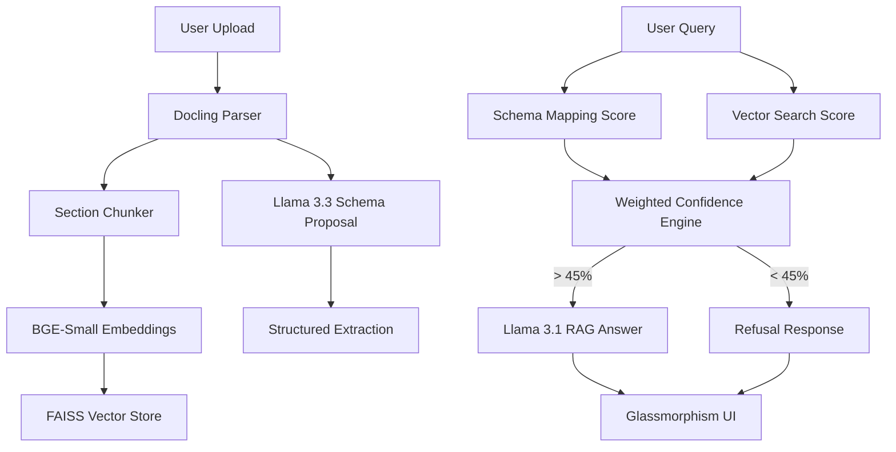

# TRD: Ultra Doc-Intelligence Technical Architecture

## 1. System Architecture Overview

## 2. Core Components

### 2.1. Parsing & Chunking Strategy
- **Engine**: IBM Docling for layout-aware parsing.
- **Semantic Chunking**: 
    - Text is grouped by `Section` and `Page`.
    - Nearest hierarchical headings are prepended to every chunk text (e.g., `[BILLING INSTRUCTIONS] Please remit to...`).
    - Tables are converted to Markdown and indexed as atomic semantic blocks.

### 2.2. Embedding & Retrieval
- **Model**: `BAAI/bge-small-en-v1.5` for high-density semantic vectors.
- **Store**: Local FAISS index for sub-millisecond similarity search.

### 2.3. Deterministic Confidence Engine
The system uses a two-factor authentication for information retrieval:
1.  **Contextual Mapping**: Cosine similarity between Query and Extracted Schema Keys.
2.  **Semantic Search**: Maximum cosine similarity among top 5 retrieved vector chunks.
3.  **Final Score**: `(Schema_Score * 0.5) + (Vector_Score * 0.5)`.

### 2.4. Reasoning Models
- **Extraction**: Llama 3.3 70B (High reasoning for sparse entities).
- **RAG**: Llama 3.1 8B (Fast, concise response generation).

## 3. Data Flow

### 3.1. Ingestion Pipe
1.  `POST /upload`
2.  File parsed -> Hierarchical JSON.
3.  Chunks generated with heading context.
4.  FAISS index built/updated in memory.
5.  Schema proposed and data extracted (persisted in DocumentStore).

### 3.2. Query Pipe
1.  `POST /ask`
2.  Query compared to extracted schema (Contextual Score).
3.  Query searched in FAISS (Semantic Score).
4.  Weighted Confidence calculated.
5.  Threshold check -> RAG Prompting with strict logistics rules.

## 4. Interface (UI/UX)
- **Glassmorphism**: Backdrop blur (12px), translucent cards, and radial gradients.
- **Intelligence Toggles**: Custom JS components that hide technical metadata (metrics/mappings) until explicitly requested.
- **Overlay System**: CSS-driven overlays for processing states.

## 5. Environment & Dependencies
- **Backend**: FastAPI (Python 3.10+)
- **LLM Provider**: Groq API
- **Embeddings**: Sentence-Transformers
- **Vector DB**: FAISS (CPU)
- **Frontend**: Vanilla JS / CSS3
