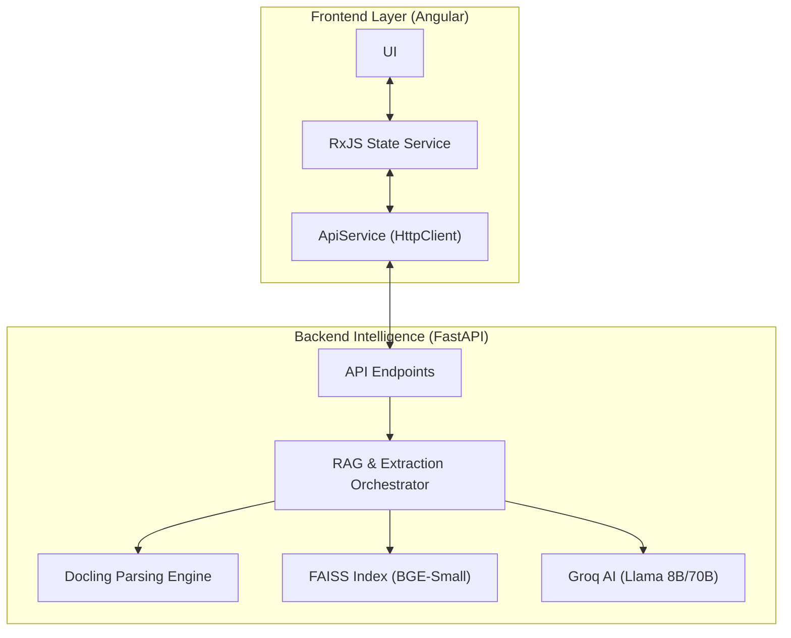

# TRD: Ultra Doc-Intelligence Architecture

## 1. System Topology

## 2. Technical Stack

| Component | Technology | Role |
| :--- | :--- | :--- |
| **Parsing** | IBM Docling | Layout-aware PDF/Table parsing |
| **Embeddings** | BGE-Small-EN | High-speed semantic vectorization |
| **Vector Store** | FAISS | Efficient similarity search |
| **LLM Inference** | Groq (Llama 3.1/3.3) | Intelligence & Reasoning |
| **Frameworks** | FastAPI / Angular 19 | Service infrastructure |

## 3. Engineering Decisions

### 3.1. Deterministic Confidence Scoring
Confidence is calculated as:
`Total = (SemanticSimilarity * 0.5) + (SchemaMappingSimilarity * 0.5)`
- **Schema Mapping**: We embed extraction keys and compare them to the query to detect structured context.
- **Semantic Similarity**: Distance of user query to nearest top-k vector chunks.

### 3.2. Prompt Engineering
- **JSON Force**: Prompts are strictly structured for Groq's `json_object` mode.
- **Brevity Guards**: System prompts enforce a "Logistics Professional" persona with strict length limits.

### 3.3. State Management
- Frontend uses a centralized `StateService` (RxJS) to synchronize data between the chat interface and the extraction/document views.

## 4. Deployment & Infrastructure
- **Containerization**: Standardized Dockerfiles for consistent environments.
- **Service Mesh**: Docker Compose handles port mapping and internal DNS.
- **API Strategy**: Stateless REST endpoints with CORS enforcement.
